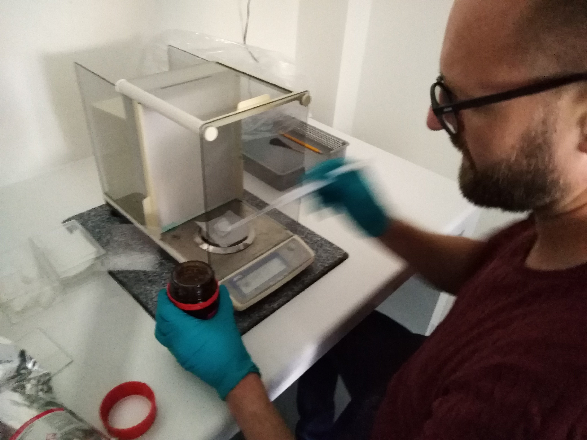
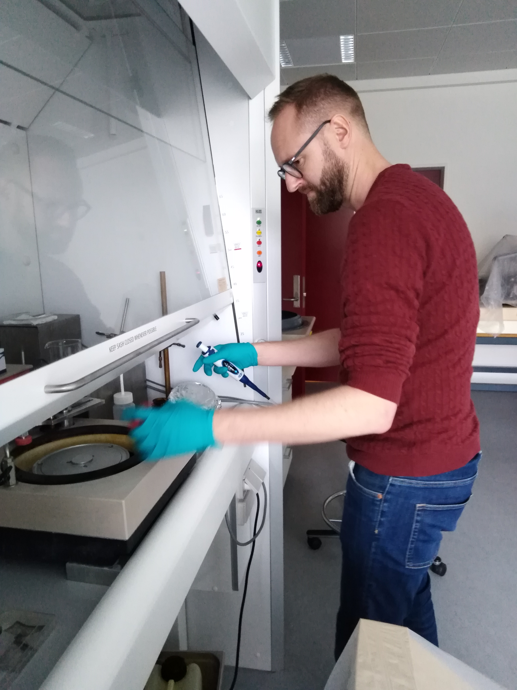
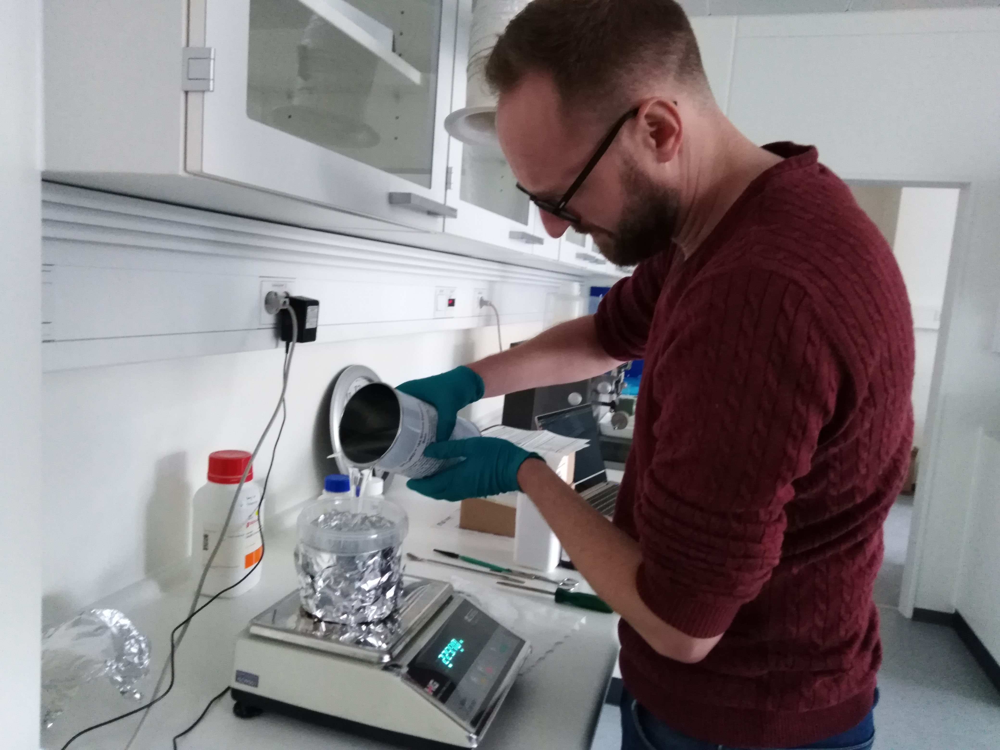
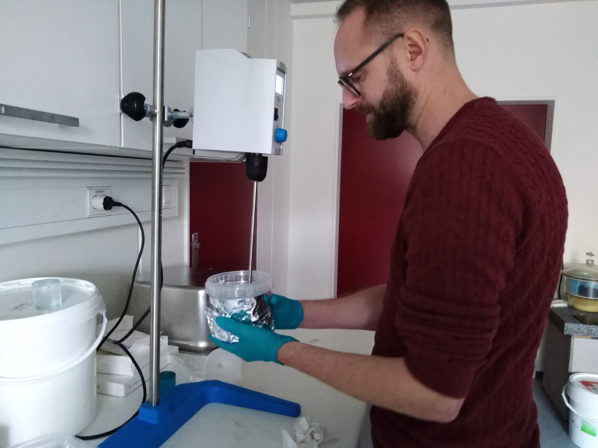
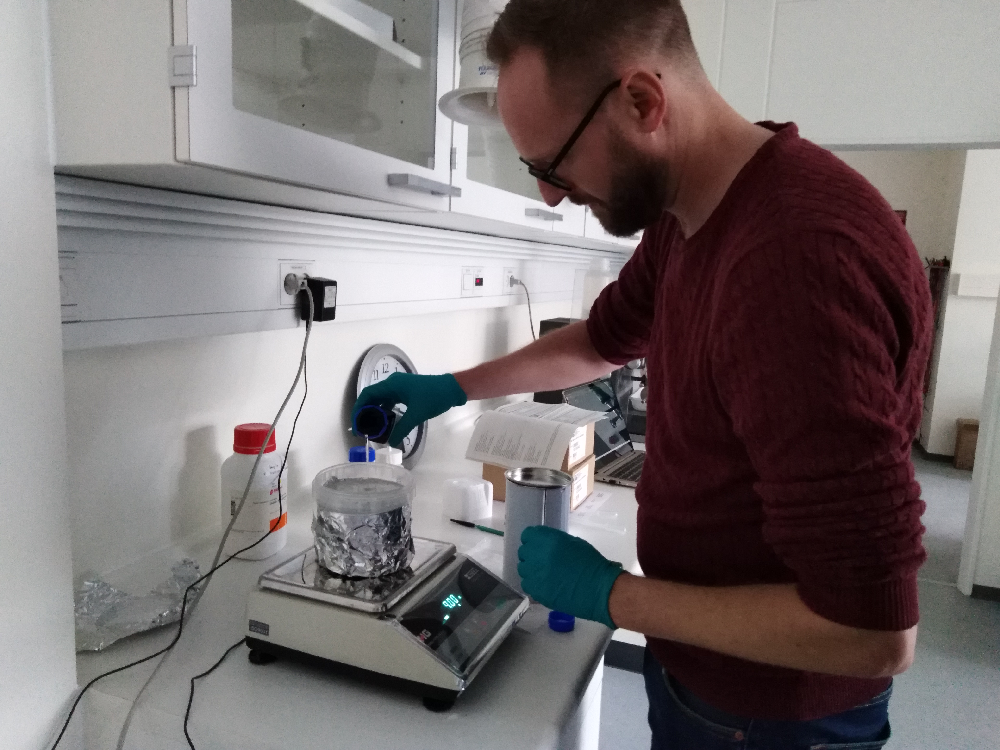
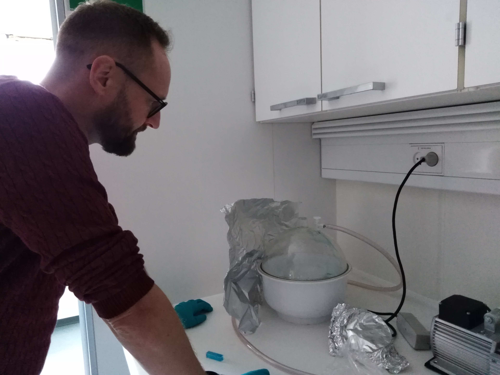

*****************************************
Casting Radiochromic Dosimeter
*****************************************

The recipe for the three dimensional radiochromic dosimeter with Leuco Malachite Green (LMG) is as follows, written in the order of adding the ingredients:

* LMG 
* Chloroform 
* Silicone Elastomer - Sylgard 184 
* Curing Agent

The exact measures of which can be found from the matlab-scripts *lmg026.m* or *lmg.m* (can be found `here`_). *lmg026.m* has a fixed ratio for all ingredients and uses 0.26\% LMG,  1.5\% Chloroform and and 5\% Curing Agent, all by weight.

.. _here: https://github.com/liavaldetaro/3d_dosimeter_DCPT/tree/master/matlabScripts

When starting a castiong project it is a good idea to have a container that is larger than the amount of dosimeter that you need. The reason for this will become apparent later. this container should be somewhat transparent to make is easier to see whats going on in it. 

Important: **SILICONE SHOULD UNDER NO CIRCUMSTANCES BE PREPARED IN REGULAR LAB-BEAKERS. USE DISPOSABLE CONTAINERS INSTEAD.**

The reason for this is that glass beakers cannot be cleaned proporly for silicone and are essentially ruined.

Casting in the evening or at night minimizes light pollution. 

========================================
Setup
========================================
To ease the process and reduce stress, make a complete setup before starting to measure. This will include the following steps (plus any you might think would improve the procedure):

* Setup and calibrate the high precision scale to measure the LMG.    
* Make sure to dim the lights in that room as much as possible.
* Do not open the lid of the LMG-container before you start to measure, to avoid oxidation.
* Make sure special spatulas are available that help measuring more precisely.
* Setup the measuring of Chloroform under a fumehood. This is important as it is highly toxic and should under no circumstances enter a persons airways. The safety and documentation on SIGMA ALDRICH should always be consulted before using any chemical and if in doubt also consult the Lab-superintendent. 
* Set the pippette for measuring the Chloroform to the needed amount. As it has a micro-liter scale, you might want to set it at a tenth or even twentieth of the amount, then measure as many times to get the correct amount.
* Get the Silicone curing agent ready at the scale used to measure them. Place the containers on a piece(s) of paper to avoid spilling on the table.
* Use a screwdriver or a pair of plyers to get the lid of the Silicone open. **Be carefull**, it can cut you bad. 
* Have spatulas and disposable pipette ready for precise measurement of the Silicone and Curing agent.
* Make sure that both the stirrer and dessicator are working properly.

========================================
Measuring LMG
========================================

LMG is meausured on a milligram-scale preferably to a precision of 3 digits or better. Do this first as the Chloroform needed to dissolve it evaporates fast and can potentially knock you out. The lab-superintendent dislikes uncosious people lying around. 
It is good practice to cover up the container with tinfoil in order minimize light pollution as LMG is highly light sensitive. This includes construction a cover of sorts as you do need some light to see whats goin on at times. Don't try to do this in complete darkness either. 
Note the precise amount

========================================
Measuring Chloroform
========================================

This is the potentially dangerous part, be careful when doin it and remember to turn on the fumehood. Apply as much Chloroform as needed and make sure you spray it all over the LMG in the buttom of the container. Also make sure to that it has dissolved ALL the LMG before porceeding. 
For smaller batche it can evaporate completely before you can dissolve the LMG completely and get the Silicone in. Then apply the amount again and hurry up to the scale.

========================================
Measuring Silicone Elastomer
========================================

This is sometimes tricky as the silicone is highly viscous, but pour slowly and when you get to withing 30 g or so of you target, the tip the container back and start "showeling" out the silicone using a spatula.
Note the precise amount

DO NOT MEASURE CURING AGENT BEFORE THIS HAS BEEN MIXED 

========================================
Mixing before adding Curing Agent
========================================

Now go to the stirrer and set it to about 500 RPM, to many RPM is unnecessary and might oxidize the LMG too much. Don't mix it for too long, just make sure it has been mixed good. About 2-3 minutes should be fine. 
Make sure not to hit the sides of the container with the propeller too much as it can shred small pieces of plastic of in to dosimeter. We don not want that.

========================================
Adding Curing agent
========================================

Now add curing agent and stop maybe 10 g before target. Use pipette to get the rest. 
It should be noted that you cannot subtract any Curing Agent or Silicone credibly without compromising the recipe.  
Note the precise amount.

Now mix again, this time a bit more thoruogh though.

========================================
Dessicate mixture
========================================

Now comes the prolonged and potentially tricky part, you need to dessicate, i.e. pull out all air of the mixture. This is far from trivial. 
First place the container in the dessicator, put the lid on and turn the vacuum pump on. Listen carefully, if the pitch of the pump goes up, the dessicator is airtight, if not try to adjust the connecting pipe from the pump to the dessicator. You know it works it the pitch goes up.
When the mixture has been in the dessicator for a few minutes, foam will start to form at the surface. The can potentially spill over the precious mixture into the dessicator, rendering it useless. Note that it has been tried to reuse this spilled dosimeter and it has simply oxidiced too much, making it too dark and thus useless. 
To make the foam receede, ease the pressure using the valve on the dessicater. BE CAREFULL. If you release it too fast, a jet of air will shoot into the container and splash it all over the dessicator. Instead, ease it slowly by nudging it left to right and slightly upwards. 
This process should be repeated until the mixture appears completely clear after the pressure has been released. Expect at least half an hour for larger samples. in the beginning this should be done at regular intervals, but later the foam will form slower. Cover the dessicator with tin-foil to minimize light pollution.

========================================
Casting
========================================

Pour the mixed dosimeter into your mold of choice. do it fast rather than slow (obviously not too fast) to minimize the forming of bubbles. This cannot be completely avoided, but they will usually go away before the dosimeter hardens.
Keep the mold in a dark place for at least 24 hours.

========================================
Important notes
========================================

There are a few important points one needs to follow to ensure the best possible results:

    - 1) **Always** adjust the refraction index of the liquid in the CT-scan, otherwise the fresnel effects will lead the edges useless (and we want to study the surface effects of the dosimeter as well)!
    - 2) Make sure to use **the same** side of the dosimeter up. You can do a small indentation on the top (but don't use permanet marker! It will dissolve in the CT scan liquid). For the small dosimeters, you can use the black box with numbered containers.
    - 3) Make sure that the claw that holds the small dosimeters is not wobbling (it does that quite often)
    - 4) When doing the post-scan, make sure to align the dosimeter properly!  Check the alignment with the Projection tool (image bellow)

.. image:: RadioDos.jpg
