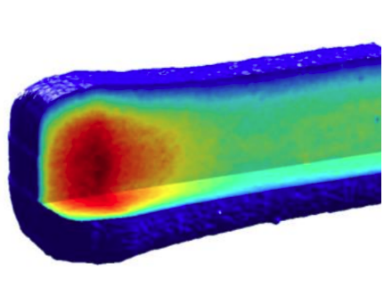
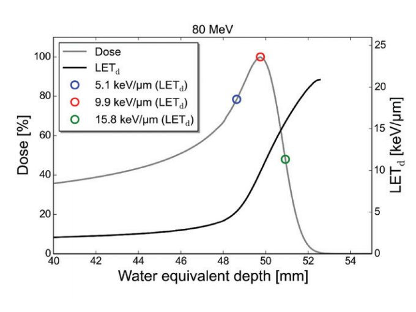

***************************
Three-dimensional dosimetry
***************************

Proton therapy is currently being investigated as a new and very promising radiotherapy modality to treat
cancer. Due to their complex interactions with matter, proton beams present a very distinct dose-delivery profile, with maximal energy deposition at the Bragg Peak. In theory, this opens the possibility of highly conformal dose delivery that in many cases cannot be achieved with photon-based radio therapy (RT).
However, highly conformal delivery results in steep dose gradients, leaving little room for error. Consequently, treatment planning with passive scattering proton therapy (PSPT) and intensity modulated proton therapy (IMPT) require specific considerations - Approximations and assumptions in the models used for computing treatment plans lead to uncertainties in dose delivery.

Protons moving through tissue scatter randomly, moving away from a straight-line path. Standard dose calculation algorithms (medical treatment planing softwares) only take scattering approximately into account. Monte Carlo (MC) based algorithms tracks individual particle trajectories, leading to a more precise dose calculation. IMPT is currently the most advanced PT technique, using mono-energetic pencil beams with different energies and entrance points to achieve the desired dose distribution, while the intensity of each beam is modulated to minimize dose to healthy tissue.

Measuring the highly modulated radiation dose deposition of PT requires high-resolution dosimetry, preferably with the capability of measuring dose distributions in 3D. Such dosimeters have been proposed, based on different dose-measurement techniques, including radiochromic and optical-stimulated-luminescent (OSL) materials, amongst others.The dye in radiochromic materials oxidizes, when irradiated the dye oxidizes, with the increased optical density dependent on the dose delivered to the dosimeter. In OSL, light is used to interrogate trapped states in crystalline materials, that carry information on the local dose. Both materials can be embedded inside a transparent silicone elastomer matrix, offering the possibility of molding anthropomorphic dosimeters.

The dependence of the dosimeter response on the linear energy transfer (LET) distribution and dose-rate requires special attention, as they have a massive impact on the measured dose.

Dose rate is also a determining factor of the consequences of a given absorbed dose. Novel treatments with FLASH irradiation (ultra-high dose rates >40Gs-1) ave shown very exciting results, inhibiting tumor growth with the similar efficiency as normal radiotherapy techniques, while significantly reducing radiation toxicity. The DCPT is working towards implementing this cutting edge technology in its beam line, making it imperative to establish a dosimetry protocol for FLASH treatments.

===================================================================
Some notes from Clinical 3D Dosimetry in Modern Radiation Therapy
===================================================================

gel dosimeters: (page 121)
- The poor absolute accuracy has been attributed to a
discrepancy in dose response between the small calibration samples and the large
volumetric gel dosimeter phantom, which has been related to both physicochem-
ical (Vandecasteele and De Deene, 2013c) and scanning factors (Vandecasteele
and De Deene, 2013d).

- Influence of the temperature history during the storage period between fabrication and irradiation of the gel dosimeter on the dose response curve.

	-When both the volumetric gel dosimeter phantom and the calibration vials are placed in the fridge after fabrication, they will cool down at different rates as a result of the difference in thermal inertia
  
	-However, if both calibration vials and volumetric gel dosimeter phantom are cooled down slowly after fabrication, for example, by placing them in a large water container, the absolute dose uncertainty is reduced to below 1%.
  
	-Theoretically, if calibration vials and the volumetric gel dosimeter would be irradiated at the same time, the chemical instability would affect both sets of gel phantoms in the same way so that no uncertainty in the calibrated dose values would be induced. However, as there is realistically a lead time of approximately 1 h between irradiation of calibration vials and volumetric gel dosimeter phantom
  
- As radiation-induced polymerization reactions are regulated by complex reaction schemes involving initiation, propagation, cyclization, transfer, and termination (Fuxman et al., 2005), it is not surprising that the dose-R 2 response of polymer gel dosimeters is dependent on dose rate.

- Machine-related artifacts may depend on the gel dosimeter shape and make it difficult to make general statements on the accuracy of the dosimeter. A larger phantom or a phantom with sharp edges may perform differently than a smaller cylindrical- or spherical-shaped phantom. Standing waves can severely deteriorate the dose distribution in dosimeters with specific shapes and spatial dimensions but may be almost completely absent if the dosimeter phantom has a slightly different shape.

