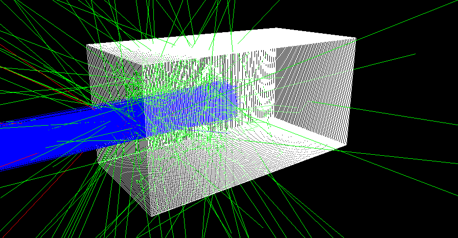
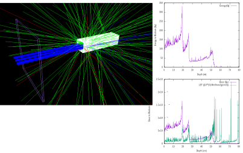
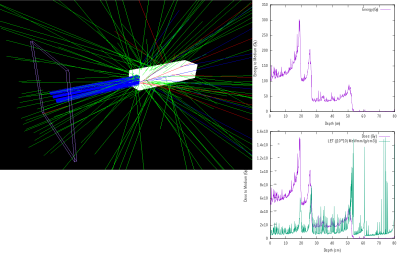

********************************
Modeling the dosimeter in TOPAS
********************************

When particles move through matter, their path is inherently random. Therefore, to truly simulate the interaction of the dosimeter with radiation fields, we must take this stochasticity into account.

This can be done by doing Monte Carlo simulations. The task is greatly simplified by utilizing Topas; a Toolkit that wraps around Geant4:
http://www.topasmc.org

==========================
Phase-space representation
==========================

