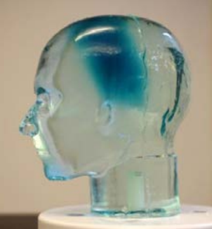

.. 3D Dosimeter documentation master file, created by
   sphinx-quickstart on Tue Jul 30 14:29:59 2019.
   You can adapt this file completely to your liking, but it should at least
   contain the root `toctree` directive.

Welcome to 3D Dosimeter's documentation!
========================================

.. toctree::
   :maxdepth: 2
   :caption: Contents:
   
   guide-intro.rst
   guide-topas.rst
   guide-dosimetry.rst
   guide-csharp.rst
   guide-3DDosimeter.rst
   atm_calculator.rmd

Indices and tables
==================
* :ref:`genindex`
* :ref:`modindex`
* :ref:`search`

